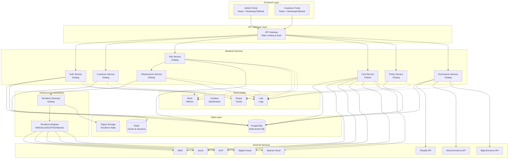

# Design Document

## Overview

Hosterizer is a multi-tenant cloud hosting platform built on a microservices architecture. The system consists of React-based frontend applications, Golang backend APIs, PostgreSQL database with row-level security, and Terraform-based infrastructure automation. The platform supports multiple cloud providers and includes comprehensive observability through the LGTM stack.

### Key Design Principles

- **Multi-tenancy**: Complete data and infrastructure isolation per customer
- **Cloud-agnostic**: Abstraction layer over multiple cloud providers
- **Infrastructure as Code**: All infrastructure managed through Terraform
- **Security-first**: Encryption at rest and in transit, RBAC, MFA
- **Observability**: Comprehensive logging, metrics, and tracing
- **Scalability**: Horizontal scaling for APIs and database read replicas

## Architecture

### High-Level Architecture



### Service Responsibilities

#### Auth Service
- User authentication (username/password, MFA)
- JWT token generation and validation
- Role-based access control (Administrator, Customer)
- Session management
- Account lockout after failed attempts

#### Customer Service
- Customer CRUD operations
- White-label configuration management
- Customer tier management (standard, premium)
- Customer metadata and preferences

#### Site Service
- Site CRUD operations
- Site deployment lifecycle management
- Site status tracking
- Site configuration management
- Deployment request validation

#### Infrastructure Service
- Terraform workflow orchestration
- IaC module selection based on cloud provider
- Infrastructure provisioning queue management
- Terraform state management
- Deployment status updates

#### Cost Service
- Cloud provider cost data collection
- Cost aggregation per customer and site
- Cost forecasting and trend analysis
- Budget threshold monitoring
- Cost report generation

#### Policy Service
- Cloud policy definition and storage
- Policy validation against deployment requests
- Compliance checking
- Policy violation reporting

#### Ecommerce Service
- Ecommerce platform integration management
- Credential storage and validation
- Platform-specific API interactions
- Integration status monitoring

## Components and Interfaces

### Frontend Components

#### Admin Portal

**Technology Stack:**
- React 18+
- TypeScript
- React Router for navigation
- Bootstrap 5 or Tailwind CSS
- Axios for API calls
- React Query for data fetching

**Key Components:**
- Dashboard (overview metrics)
- Customer Management (list, create, edit, deactivate)
- Site Management (list, view details, search/filter)
- Cost Reports (charts, filters, export)
- Policy Management (create, edit, assign)
- Observability Links (Grafana dashboards)
- User Profile (settings, logout)

#### Customer Portal

**Technology Stack:**
- React 18+
- TypeScript
- React Router for navigation
- Bootstrap 5 or Tailwind CSS (configurable per customer)
- Axios for API calls
- React Query for data fetching

**Key Components:**
- Dashboard (site overview, costs)
- Site Management (create, view, update, delete)
- Deployment Status (real-time updates)
- Cost Dashboard (per-site costs)
- Ecommerce Integration (configure platforms)
- User Profile (settings, logout)
- White-label branding application

### Backend API Interfaces

#### Auth Service API

```
POST   /api/v1/auth/login
POST   /api/v1/auth/logout
POST   /api/v1/auth/refresh
POST   /api/v1/auth/mfa/setup
POST   /api/v1/auth/mfa/verify
GET    /api/v1/auth/me
```

#### Customer Service API

```
GET    /api/v1/customers
POST   /api/v1/customers
GET    /api/v1/customers/:id
PUT    /api/v1/customers/:id
DELETE /api/v1/customers/:id
GET    /api/v1/customers/:id/white-label
PUT    /api/v1/customers/:id/white-label
```

#### Site Service API

```
GET    /api/v1/sites
POST   /api/v1/sites
GET    /api/v1/sites/:id
PUT    /api/v1/sites/:id
DELETE /api/v1/sites/:id
GET    /api/v1/sites/:id/status
POST   /api/v1/sites/:id/deploy
```

#### Cost Service API

```
GET    /api/v1/costs/customers/:id
GET    /api/v1/costs/sites/:id
GET    /api/v1/costs/reports
GET    /api/v1/costs/forecast
```

#### Policy Service API

```
GET    /api/v1/policies
POST   /api/v1/policies
GET    /api/v1/policies/:id
PUT    /api/v1/policies/:id
DELETE /api/v1/policies/:id
POST   /api/v1/policies/validate
```

#### Ecommerce Service API

```
GET    /api/v1/ecommerce/platforms
GET    /api/v1/sites/:id/ecommerce
POST   /api/v1/sites/:id/ecommerce
PUT    /api/v1/sites/:id/ecommerce/:platform
DELETE /api/v1/sites/:id/ecommerce/:platform
POST   /api/v1/ecommerce/validate
```

## Data Models

### Database Schema

#### users table
```sql
CREATE TABLE users (
    id BIGSERIAL PRIMARY KEY,
    uuid UUID DEFAULT gen_random_uuid() UNIQUE NOT NULL,
    email TEXT NOT NULL UNIQUE,
    password_hash TEXT NOT NULL,
    first_name TEXT NOT NULL,
    last_name TEXT NOT NULL,
    role TEXT NOT NULL CHECK (role IN ('administrator', 'customer')),
    mfa_enabled BOOLEAN DEFAULT FALSE,
    mfa_secret TEXT,
    failed_login_attempts INTEGER DEFAULT 0,
    locked_until TIMESTAMPTZ,
    last_login_at TIMESTAMPTZ,
    created_at TIMESTAMPTZ NOT NULL DEFAULT NOW(),
    updated_at TIMESTAMPTZ NOT NULL DEFAULT NOW()
);

CREATE INDEX idx_users_email ON users(email);
CREATE INDEX idx_users_role ON users(role);
```

#### customers table
```sql
CREATE TABLE customers (
    id BIGSERIAL PRIMARY KEY,
    uuid UUID DEFAULT gen_random_uuid() UNIQUE NOT NULL,
    name TEXT NOT NULL,
    tier TEXT NOT NULL DEFAULT 'standard' CHECK (tier IN ('standard', 'premium')),
    status TEXT NOT NULL DEFAULT 'active' CHECK (status IN ('active', 'inactive', 'suspended')),
    owner_user_id BIGINT NOT NULL REFERENCES users(id),
    white_label_config JSONB DEFAULT '{}'::jsonb,
    metadata JSONB DEFAULT '{}'::jsonb,
    created_at TIMESTAMPTZ NOT NULL DEFAULT NOW(),
    updated_at TIMESTAMPTZ NOT NULL DEFAULT NOW()
);

CREATE INDEX idx_customers_status ON customers(status);
CREATE INDEX idx_customers_owner ON customers(owner_user_id);
```

#### sites table
```sql
CREATE TABLE sites (
    id BIGSERIAL PRIMARY KEY,
    uuid UUID DEFAULT gen_random_uuid() UNIQUE NOT NULL,
    customer_id BIGINT NOT NULL REFERENCES customers(id) ON DELETE CASCADE,
    name TEXT NOT NULL,
    domain TEXT,
    cloud_provider TEXT NOT NULL CHECK (cloud_provider IN ('aws', 'azure', 'gcp', 'digitalocean', 'akamai')),
    region TEXT NOT NULL,
    status TEXT NOT NULL DEFAULT 'pending' CHECK (status IN ('pending', 'provisioning', 'active', 'updating', 'failed', 'deleting', 'deleted')),
    configuration JSONB NOT NULL DEFAULT '{}'::jsonb,
    infrastructure_metadata JSONB DEFAULT '{}'::jsonb,
    created_at TIMESTAMPTZ NOT NULL DEFAULT NOW(),
    updated_at TIMESTAMPTZ NOT NULL DEFAULT NOW(),
    deleted_at TIMESTAMPTZ
);

CREATE INDEX idx_sites_customer ON sites(customer_id);
CREATE INDEX idx_sites_status ON sites(status);
CREATE INDEX idx_sites_cloud_provider ON sites(cloud_provider);
CREATE INDEX idx_sites_deleted ON sites(deleted_at) WHERE deleted_at IS NOT NULL;

-- Row-level security
ALTER TABLE sites ENABLE ROW LEVEL SECURITY;

CREATE POLICY customer_sites_policy ON sites
    FOR ALL
    TO app_user
    USING (customer_id = current_setting('app.current_customer_id')::BIGINT);
```

#### deployments table
```sql
CREATE TABLE deployments (
    id BIGSERIAL PRIMARY KEY,
    uuid UUID DEFAULT gen_random_uuid() UNIQUE NOT NULL,
    site_id BIGINT NOT NULL REFERENCES sites(id) ON DELETE CASCADE,
    deployment_type TEXT NOT NULL CHECK (deployment_type IN ('create', 'update', 'delete')),
    status TEXT NOT NULL DEFAULT 'queued' CHECK (status IN ('queued', 'running', 'completed', 'failed', 'cancelled')),
    terraform_plan TEXT,
    terraform_output TEXT,
    error_message TEXT,
    started_at TIMESTAMPTZ,
    completed_at TIMESTAMPTZ,
    created_at TIMESTAMPTZ NOT NULL DEFAULT NOW()
);

CREATE INDEX idx_deployments_site ON deployments(site_id);
CREATE INDEX idx_deployments_status ON deployments(status);
```

#### policies table
```sql
CREATE TABLE policies (
    id BIGSERIAL PRIMARY KEY,
    uuid UUID DEFAULT gen_random_uuid() UNIQUE NOT NULL,
    name TEXT NOT NULL,
    description TEXT,
    policy_type TEXT NOT NULL CHECK (policy_type IN ('resource_limit', 'security', 'cost')),
    rules JSONB NOT NULL,
    enabled BOOLEAN DEFAULT TRUE,
    created_at TIMESTAMPTZ NOT NULL DEFAULT NOW(),
    updated_at TIMESTAMPTZ NOT NULL DEFAULT NOW()
);

CREATE INDEX idx_policies_type ON policies(policy_type);
CREATE INDEX idx_policies_enabled ON policies(enabled);
```

#### ecommerce_integrations table
```sql
CREATE TABLE ecommerce_integrations (
    id BIGSERIAL PRIMARY KEY,
    uuid UUID DEFAULT gen_random_uuid() UNIQUE NOT NULL,
    site_id BIGINT NOT NULL REFERENCES sites(id) ON DELETE CASCADE,
    platform TEXT NOT NULL CHECK (platform IN ('shopify', 'woocommerce', 'bigcommerce')),
    credentials_encrypted TEXT NOT NULL,
    configuration JSONB DEFAULT '{}'::jsonb,
    status TEXT NOT NULL DEFAULT 'active' CHECK (status IN ('active', 'inactive', 'error')),
    last_sync_at TIMESTAMPTZ,
    created_at TIMESTAMPTZ NOT NULL DEFAULT NOW(),
    updated_at TIMESTAMPTZ NOT NULL DEFAULT NOW(),
    UNIQUE(site_id, platform)
);

CREATE INDEX idx_ecommerce_site ON ecommerce_integrations(site_id);
CREATE INDEX idx_ecommerce_platform ON ecommerce_integrations(platform);
```

#### cost_records table
```sql
CREATE TABLE cost_records (
    id BIGSERIAL PRIMARY KEY,
    site_id BIGINT NOT NULL REFERENCES sites(id) ON DELETE CASCADE,
    customer_id BIGINT NOT NULL REFERENCES customers(id) ON DELETE CASCADE,
    cloud_provider TEXT NOT NULL,
    cost_date DATE NOT NULL,
    amount NUMERIC(10, 2) NOT NULL,
    currency TEXT NOT NULL DEFAULT 'USD',
    resource_breakdown JSONB DEFAULT '{}'::jsonb,
    created_at TIMESTAMPTZ NOT NULL DEFAULT NOW(),
    UNIQUE(site_id, cost_date)
);

CREATE INDEX idx_cost_records_site ON cost_records(site_id, cost_date DESC);
CREATE INDEX idx_cost_records_customer ON cost_records(customer_id, cost_date DESC);
CREATE INDEX idx_cost_records_date ON cost_records(cost_date DESC);
```

### Domain Models (Golang)

```go
// domain/user.go
type User struct {
    ID                   int64
    UUID                 string
    Email                string
    PasswordHash         string
    FirstName            string
    LastName             string
    Role                 UserRole
    MFAEnabled           bool
    MFASecret            string
    FailedLoginAttempts  int
    LockedUntil          *time.Time
    LastLoginAt          *time.Time
    CreatedAt            time.Time
    UpdatedAt            time.Time
}

type UserRole string

const (
    RoleAdministrator UserRole = "administrator"
    RoleCustomer      UserRole = "customer"
)

// domain/customer.go
type Customer struct {
    ID               int64
    UUID             string
    Name             string
    Tier             CustomerTier
    Status           CustomerStatus
    OwnerUserID      int64
    WhiteLabelConfig WhiteLabelConfig
    Metadata         map[string]interface{}
    CreatedAt        time.Time
    UpdatedAt        time.Time
}

type CustomerTier string

const (
    TierStandard CustomerTier = "standard"
    TierPremium  CustomerTier = "premium"
)

type CustomerStatus string

const (
    StatusActive    CustomerStatus = "active"
    StatusInactive  CustomerStatus = "inactive"
    StatusSuspended CustomerStatus = "suspended"
)

type WhiteLabelConfig struct {
    LogoURL     string            `json:"logo_url"`
    ColorScheme map[string]string `json:"color_scheme"`
    CustomDomain string           `json:"custom_domain"`
}

// domain/site.go
type Site struct {
    ID                     int64
    UUID                   string
    CustomerID             int64
    Name                   string
    Domain                 string
    CloudProvider          CloudProvider
    Region                 string
    Status                 SiteStatus
    Configuration          map[string]interface{}
    InfrastructureMetadata map[string]interface{}
    CreatedAt              time.Time
    UpdatedAt              time.Time
    DeletedAt              *time.Time
}

type CloudProvider string

const (
    ProviderAWS          CloudProvider = "aws"
    ProviderAzure        CloudProvider = "azure"
    ProviderGCP          CloudProvider = "gcp"
    ProviderDigitalOcean CloudProvider = "digitalocean"
    ProviderAkamai       CloudProvider = "akamai"
)

type SiteStatus string

const (
    SiteStatusPending      SiteStatus = "pending"
    SiteStatusProvisioning SiteStatus = "provisioning"
    SiteStatusActive       SiteStatus = "active"
    SiteStatusUpdating     SiteStatus = "updating"
    SiteStatusFailed       SiteStatus = "failed"
    SiteStatusDeleting     SiteStatus = "deleting"
    SiteStatusDeleted      SiteStatus = "deleted"
)

// domain/deployment.go
type Deployment struct {
    ID              int64
    UUID            string
    SiteID          int64
    DeploymentType  DeploymentType
    Status          DeploymentStatus
    TerraformPlan   string
    TerraformOutput string
    ErrorMessage    string
    StartedAt       *time.Time
    CompletedAt     *time.Time
    CreatedAt       time.Time
}

type DeploymentType string

const (
    DeploymentCreate DeploymentType = "create"
    DeploymentUpdate DeploymentType = "update"
    DeploymentDelete DeploymentType = "delete"
)

type DeploymentStatus string

const (
    DeploymentQueued    DeploymentStatus = "queued"
    DeploymentRunning   DeploymentStatus = "running"
    DeploymentCompleted DeploymentStatus = "completed"
    DeploymentFailed    DeploymentStatus = "failed"
    DeploymentCancelled DeploymentStatus = "cancelled"
)

// domain/policy.go
type Policy struct {
    ID          int64
    UUID        string
    Name        string
    Description string
    PolicyType  PolicyType
    Rules       map[string]interface{}
    Enabled     bool
    CreatedAt   time.Time
    UpdatedAt   time.Time
}

type PolicyType string

const (
    PolicyResourceLimit PolicyType = "resource_limit"
    PolicySecurity      PolicyType = "security"
    PolicyCost          PolicyType = "cost"
)

// domain/ecommerce.go
type EcommerceIntegration struct {
    ID                  int64
    UUID                string
    SiteID              int64
    Platform            EcommercePlatform
    CredentialsEncrypted string
    Configuration       map[string]interface{}
    Status              IntegrationStatus
    LastSyncAt          *time.Time
    CreatedAt           time.Time
    UpdatedAt           time.Time
}

type EcommercePlatform string

const (
    PlatformShopify      EcommercePlatform = "shopify"
    PlatformWooCommerce  EcommercePlatform = "woocommerce"
    PlatformBigCommerce  EcommercePlatform = "bigcommerce"
)

type IntegrationStatus string

const (
    IntegrationActive   IntegrationStatus = "active"
    IntegrationInactive IntegrationStatus = "inactive"
    IntegrationError    IntegrationStatus = "error"
)
```

## Error Handling

### Error Response Format

All API errors follow a consistent JSON structure:

```json
{
  "error": {
    "code": "VALIDATION_ERROR",
    "message": "Invalid site configuration",
    "details": {
      "field": "region",
      "reason": "Region 'invalid-region' is not supported for provider 'aws'"
    },
    "trace_id": "550e8400-e29b-41d4-a716-446655440000"
  }
}
```

### Error Codes

- `AUTHENTICATION_ERROR`: Authentication failed
- `AUTHORIZATION_ERROR`: Insufficient permissions
- `VALIDATION_ERROR`: Input validation failed
- `NOT_FOUND`: Resource not found
- `CONFLICT`: Resource conflict (e.g., duplicate)
- `RATE_LIMIT_EXCEEDED`: Too many requests
- `INTERNAL_ERROR`: Unexpected server error
- `EXTERNAL_SERVICE_ERROR`: External service failure
- `POLICY_VIOLATION`: Deployment violates policy

### Error Handling Strategy

1. **Service Layer**: Catch and wrap errors with context
2. **API Layer**: Convert domain errors to HTTP responses
3. **Logging**: Log all errors with trace IDs
4. **Monitoring**: Alert on error rate thresholds
5. **User Feedback**: Provide actionable error messages

## Testing Strategy

### Unit Testing

**Backend Services (Golang):**
- Test coverage target: 80%+
- Use table-driven tests
- Mock external dependencies (database, cloud APIs)
- Test error paths and edge cases

**Frontend Components (React):**
- Test coverage target: 70%+
- Use React Testing Library
- Test user interactions and state changes
- Mock API calls

### Integration Testing

- Test API endpoints with real database (test instance)
- Test Terraform module execution (isolated test accounts)
- Test authentication and authorization flows
- Test multi-tenant data isolation

### End-to-End Testing

- Test complete user workflows (site creation, deployment)
- Test admin and customer portal interactions
- Test cross-service communication
- Use Cypress or Playwright for browser automation

### Performance Testing

- Load test API endpoints (target: 1000 req/s per service)
- Test database query performance
- Test Terraform execution concurrency
- Monitor resource usage under load

### Security Testing

- Penetration testing for authentication
- SQL injection testing
- XSS and CSRF testing
- Test tenant isolation boundaries
- Scan for dependency vulnerabilities

## Deployment Architecture

### Infrastructure Components

**Application Tier:**
- Kubernetes cluster for backend services
- Horizontal pod autoscaling
- Service mesh (Istio) for traffic management
- Ingress controller with TLS termination

**Data Tier:**
- PostgreSQL primary with read replicas
- Redis cluster for caching and sessions
- S3-compatible storage for Terraform state

**Observability Tier:**
- Loki for log aggregation
- Grafana for dashboards
- Tempo for distributed tracing
- Mimir for metrics storage

### Deployment Pipeline

1. **Build**: Compile Go binaries, build React apps
2. **Test**: Run unit and integration tests
3. **Security Scan**: Scan for vulnerabilities
4. **Package**: Build Docker images
5. **Deploy to Staging**: Automated deployment
6. **E2E Tests**: Run end-to-end tests
7. **Deploy to Production**: Manual approval required
8. **Health Check**: Verify deployment health

### High Availability

- Multi-AZ deployment for all services
- Database replication with automatic failover
- Load balancing across service instances
- Circuit breakers for external service calls
- Graceful degradation when services unavailable

## Security Architecture

### Authentication Flow

1. User submits credentials to Auth Service
2. Auth Service validates credentials against database
3. If MFA enabled, user provides MFA token
4. Auth Service generates JWT with user claims
5. JWT stored in HTTP-only cookie
6. Subsequent requests include JWT for authentication

### Authorization Model

**Role-Based Access Control:**
- Administrator: Full access to Admin Portal and all APIs
- Customer: Access to Customer Portal and tenant-scoped APIs

**Tenant Isolation:**
- Database row-level security enforces tenant boundaries
- API middleware sets tenant context from JWT
- All queries filtered by tenant ID

### Data Encryption

**At Rest:**
- PostgreSQL transparent data encryption
- Encrypted columns for sensitive data (credentials)
- Encrypted S3 buckets for Terraform state

**In Transit:**
- TLS 1.2+ for all HTTP communication
- Encrypted database connections
- Encrypted Redis connections

### Secrets Management

- Store secrets in HashiCorp Vault or cloud provider secret manager
- Rotate secrets automatically (90-day cycle)
- Never log or expose secrets in responses
- Use environment variables for service configuration

## Observability Implementation

### Logging Strategy

**Structured Logging:**
```json
{
  "timestamp": "2024-01-15T10:30:00Z",
  "level": "info",
  "service": "site-service",
  "trace_id": "550e8400-e29b-41d4-a716-446655440000",
  "user_id": "123",
  "customer_id": "456",
  "message": "Site deployment started",
  "site_id": "789",
  "cloud_provider": "aws"
}
```

**Log Levels:**
- DEBUG: Detailed diagnostic information
- INFO: General informational messages
- WARN: Warning messages for potential issues
- ERROR: Error messages for failures
- FATAL: Critical errors requiring immediate attention

### Metrics Collection

**Application Metrics:**
- API request rate and latency (per endpoint)
- Database query performance
- Cache hit/miss rates
- Deployment success/failure rates
- Active user sessions

**Infrastructure Metrics:**
- CPU and memory usage
- Network throughput
- Disk I/O
- Container restart counts

### Distributed Tracing

- Trace all API requests across services
- Include database queries in traces
- Track Terraform execution spans
- Correlate logs with traces using trace IDs

### Dashboards

**Admin Dashboard:**
- System health overview
- Active deployments
- Error rates by service
- Cost trends
- Customer growth metrics

**Customer Dashboard:**
- Site status and uptime
- Deployment history
- Resource usage
- Cost breakdown

## Terraform Module Structure

### Module Organization

```
terraform/
├── modules/
│   ├── aws/
│   │   ├── networking/
│   │   ├── compute/
│   │   ├── database/
│   │   └── storage/
│   ├── azure/
│   │   ├── networking/
│   │   ├── compute/
│   │   ├── database/
│   │   └── storage/
│   ├── gcp/
│   │   ├── networking/
│   │   ├── compute/
│   │   ├── database/
│   │   └── storage/
│   ├── digitalocean/
│   │   ├── networking/
│   │   ├── compute/
│   │   └── database/
│   └── akamai/
│       ├── networking/
│       └── compute/
└── templates/
    └── site-deployment/
```

### Module Interface

Each cloud provider module exposes a consistent interface:

**Inputs:**
- `site_name`: Name of the site
- `customer_id`: Customer identifier
- `region`: Deployment region
- `instance_type`: Compute instance size
- `database_config`: Database configuration
- `tags`: Resource tags

**Outputs:**
- `site_url`: Public URL of deployed site
- `database_endpoint`: Database connection string
- `resource_ids`: Map of provisioned resource IDs

### State Management

- Remote state backend (S3 + DynamoDB for AWS)
- State locking to prevent concurrent modifications
- State encryption at rest
- Separate state files per site deployment
- State backup and versioning

## Cost Management Implementation

### Cost Collection

**Cloud Provider APIs:**
- AWS Cost Explorer API
- Azure Cost Management API
- GCP Cloud Billing API
- Digital Ocean API
- Akamai API

**Collection Frequency:**
- Daily cost data collection
- Hourly for real-time monitoring (where supported)
- Store in `cost_records` table

### Cost Aggregation

- Aggregate by customer, site, cloud provider
- Calculate month-to-date and projected costs
- Track cost trends and anomalies
- Generate cost allocation reports

### Budget Alerts

- Configure budget thresholds per customer
- Send alerts at 50%, 75%, 90%, 100% of budget
- Email and in-app notifications
- Automatic notifications to administrators

## Scalability Considerations

### Horizontal Scaling

- Stateless backend services (scale pods)
- Database read replicas for read-heavy workloads
- Redis cluster for distributed caching
- Queue-based deployment processing

### Performance Optimization

- Database query optimization and indexing
- API response caching (Redis)
- CDN for static frontend assets
- Connection pooling for database
- Batch processing for cost collection

### Capacity Planning

- Monitor resource utilization trends
- Auto-scaling based on CPU/memory thresholds
- Database storage growth monitoring
- Terraform execution queue depth monitoring
