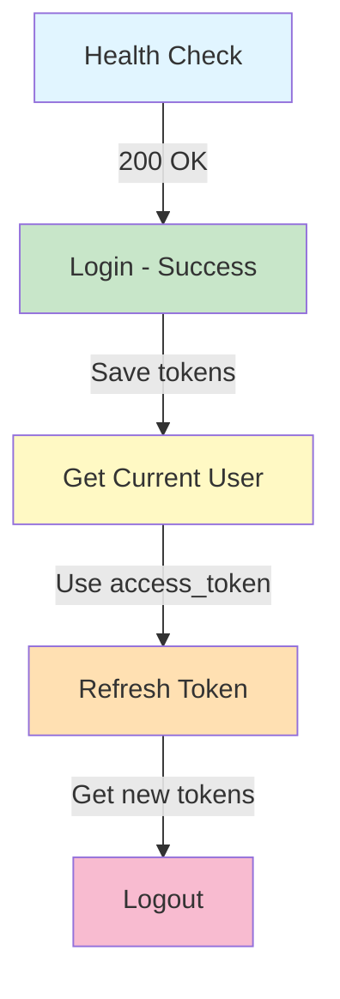
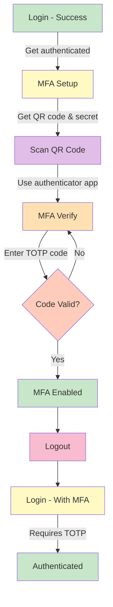
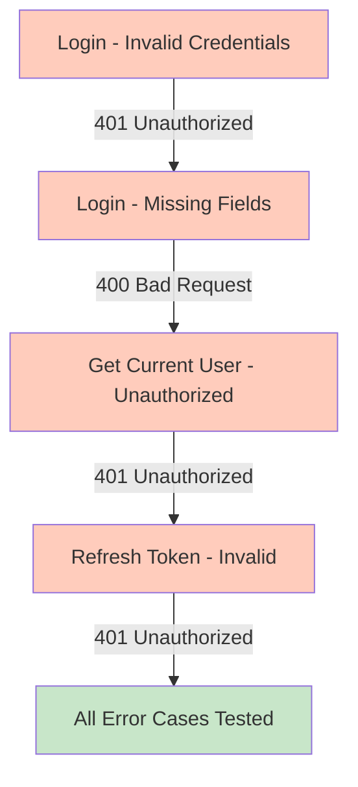
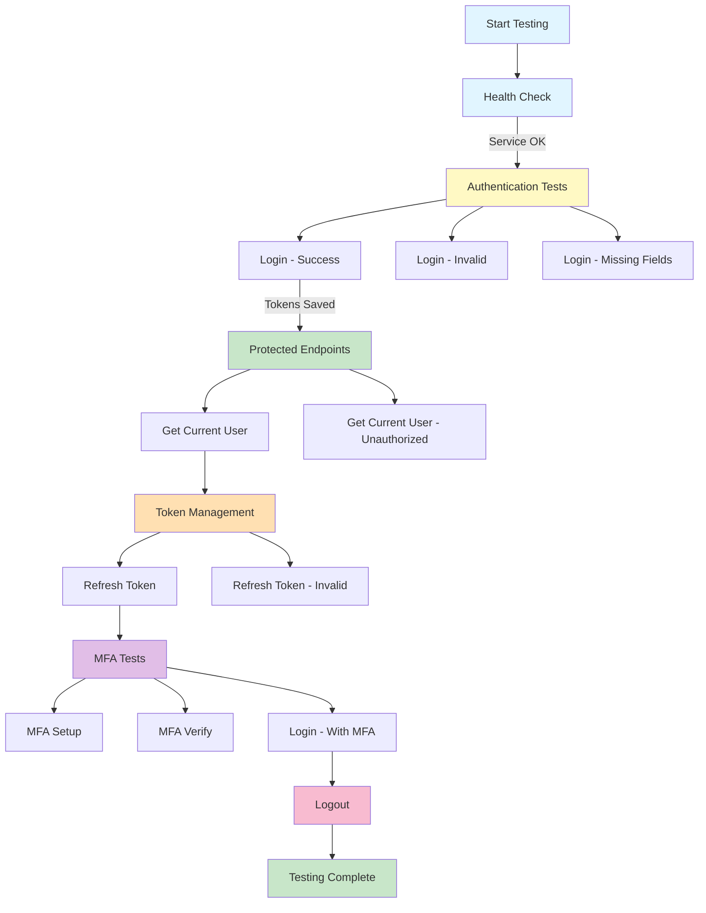
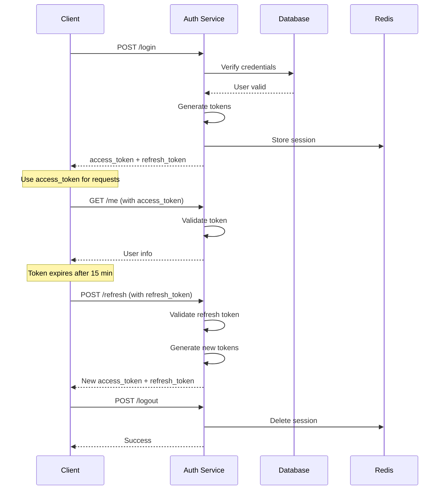
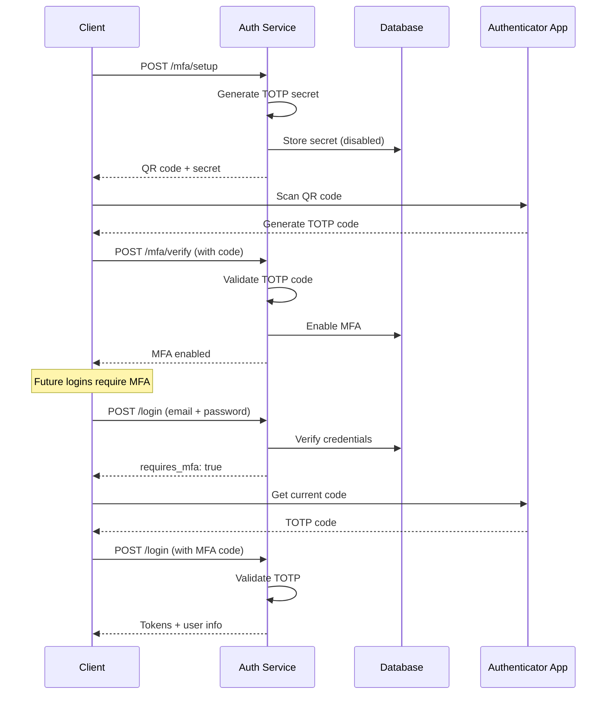
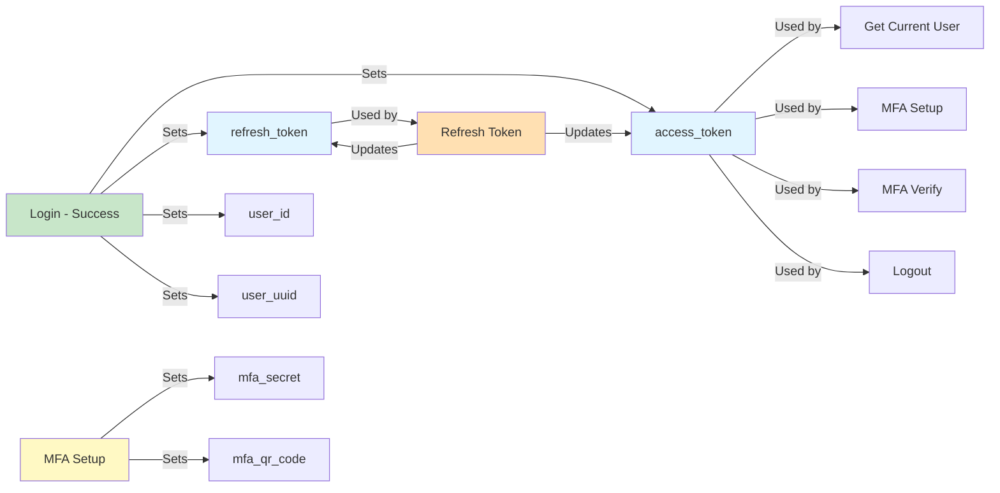

# API Test Flows

Visual guide to testing workflows in the Hosterizer API collection.

## Standard Authentication Flow



## MFA Setup Flow



## Error Testing Flow



## Complete Test Suite Flow



## Request Dependencies

### No Dependencies (Can run anytime)
- Health Check
- Login - Invalid Credentials
- Login - Missing Fields
- Get Current User - Unauthorized
- Refresh Token - Invalid

### Requires Login
- Get Current User
- MFA Setup
- MFA Verify
- Logout

### Requires Refresh Token
- Refresh Token

### Requires MFA Setup
- MFA Verify
- Login - With MFA (after MFA enabled)

## Execution Order

### Recommended Order for First Run
1. Health Check
2. Login - Success
3. Get Current User
4. MFA Setup
5. MFA Verify (manual: enter code from app)
6. Refresh Token
7. Logout

### Quick Smoke Test
1. Health Check
2. Login - Success
3. Get Current User
4. Logout

### Error Testing Only
1. Login - Invalid Credentials
2. Login - Missing Fields
3. Get Current User - Unauthorized
4. Refresh Token - Invalid

### MFA Testing Only
1. Login - Success
2. MFA Setup
3. MFA Verify
4. Logout
5. Login - With MFA

## Token Lifecycle



## MFA Flow



## Environment Variable Flow



## Testing Strategies

### Smoke Testing (2 minutes)
Quick verification that core functionality works:
1. Health Check
2. Login - Success
3. Get Current User

### Regression Testing (5 minutes)
Verify all functionality after changes:
1. Run entire "Auth Service" folder
2. Review all test results
3. Verify no regressions

### Integration Testing (10 minutes)
Test complete user journeys:
1. Standard auth flow
2. MFA setup flow
3. Token refresh flow
4. Error handling flow

### Security Testing (15 minutes)
Verify security controls:
1. Test invalid credentials
2. Test missing authentication
3. Test invalid tokens
4. Test MFA enforcement
5. Test account lockout (manual)

## Tips for Efficient Testing

1. **Use Folder Runner**: Run entire folders instead of individual requests
2. **Check Test Results**: Review the "Tests" tab after each request
3. **Monitor Logs**: Keep auth service logs visible during testing
4. **Use Variables**: Let the collection manage tokens automatically
5. **Test Errors**: Don't just test happy paths
6. **Document Issues**: Note any unexpected behavior
7. **Clean State**: Logout between test runs for clean state

## Troubleshooting Flows

### Token Issues
```
Login fails → Check credentials
Token expired → Run Refresh Token
Refresh fails → Run Login - Success again
```

### MFA Issues
```
Setup fails → Check authentication
Verify fails → Check TOTP code is current
Login fails → Ensure MFA is enabled
```

### Connection Issues
```
Health Check fails → Check service is running
All requests fail → Check base_url in environment
Timeout → Check service logs for errors
```
